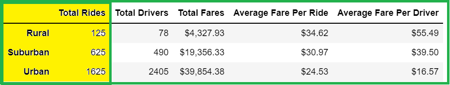
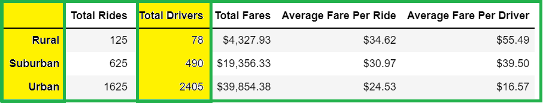
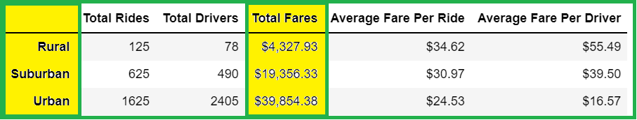
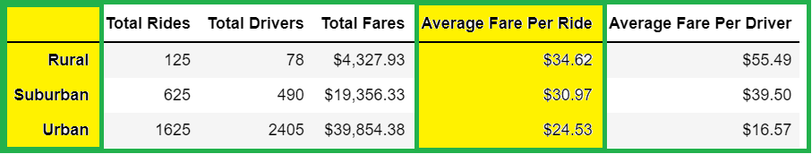
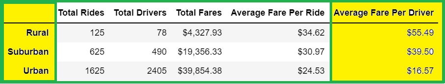

# PyBer_Analysis (Matplotlib project)

## Overview of the project

In this project, we were working with `Ride sharing` data-set using jupyter notebook, pandas and python's two dimensional 
plotting library, matplotlib. Pandas is being used for data manipulation and analysis whereas, matplotlib is used to
visualize the data. These visualizations can be helpful in presenting complex findings in an informative and engaging way.

### Purpose

The main purpose of the project was to analyze the `Ride sharing` data-set to improve the access of ride sharing services
and determine the affordability for under-served neighborhoods. In this project, we have created a data frame of the
ride sharing data by city type and created a multiple line graph to visualize the trend in total weekly fare for
each city types. This can be helpful for the Pyber management to make informed decisions on how to add more
ridership to the application by making right adjustments to the ride-fares and the number of drivers.

## Results

**Results based on summary dataframe:**

- `Total number of rides` in the rural cities are the lowest, which is about 8% and 20% of to that in urban and
suburban cities, respectively.

- `Total number of drivers` in the rural cities is about 3% and 15% of to that in urban and suburban cities, respectively.

- `Total ride fare` in the rural cities is about 10% and 22% of to that in urban and suburban cities, respectively.

- `Average ride fare` in the rural cities is the highest whereas the average fare per ride falls on second and third
places in suburban and urban cities, respectively amongst the various city types. 

- `Average fare per driver` in the rural cities is about 3.5 and 2.5 times higher than that of urban and suburban cities,
respectively.

**Results based on multiple line chart**

While comparing the total weekly fare between each city type, we have noticed that the total fare price in the urban cities
is the highest, which is lying in the $1600 - $2500 band. On the other hand, suburban and rural cities' total
weekly fare is much lower than that in the urban cities, and are lying in the $700 - $1400 and less than
$500 bands respectively.

## Summary

Following recommendations can be provided based on the above analysis:

1. Average fare per ride in the rural cities is on the higher side, which needs to be reduced in comparison with other
city types. By this change, affordability in the rural cities can be improved. 

2. Average fare per ride in suburban cities is also higher, which is affecting the number of rides in suburban cities.
By reducing the fare per ride, an increase in the number of rides can be expected.

3. Total drivers in urban cities are higher than the total rides in comparison with other types of cities,
which is affecting the average fare per driver in the urban cities. The average fare per ride is already the
lowest in the urban cities so it is hard to comment on why the total number of rides are not at par with the
total number of available drivers. But, from the given data-set, we can only expect an increase in the number of
rides by lowering the ride fare.

